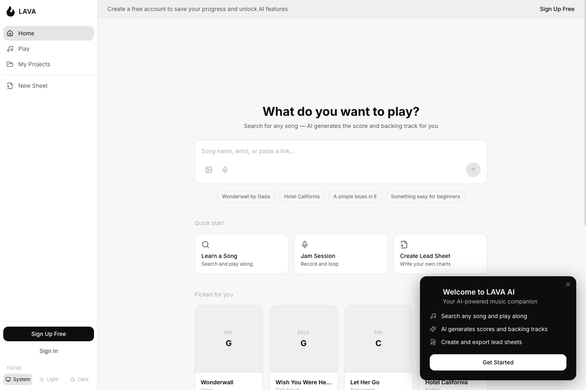
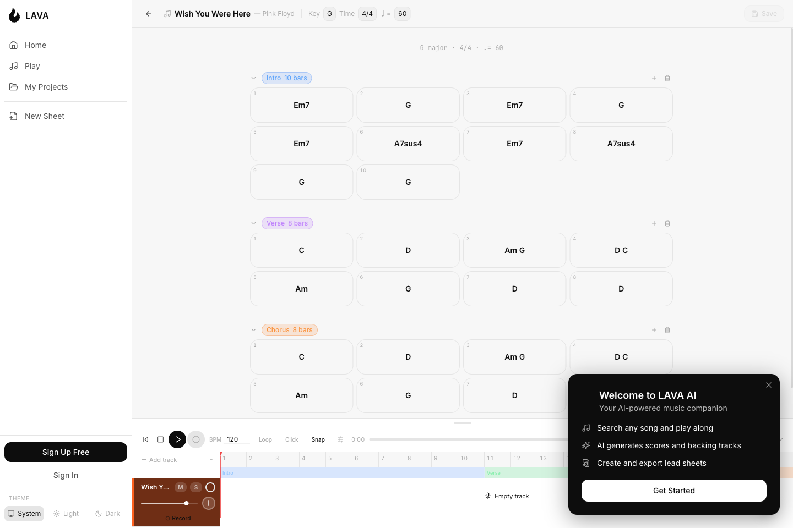
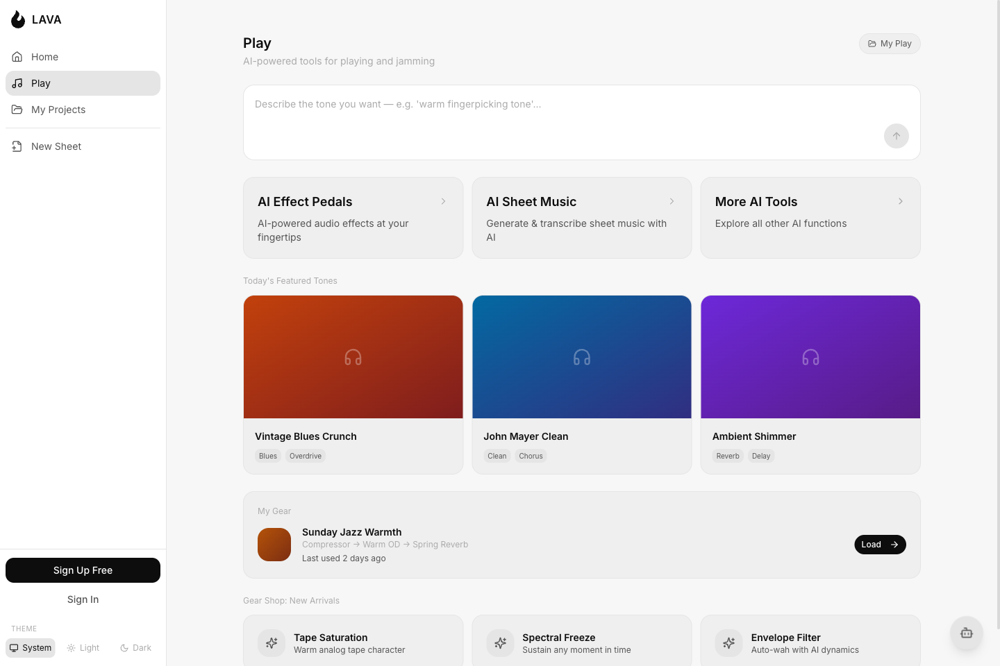
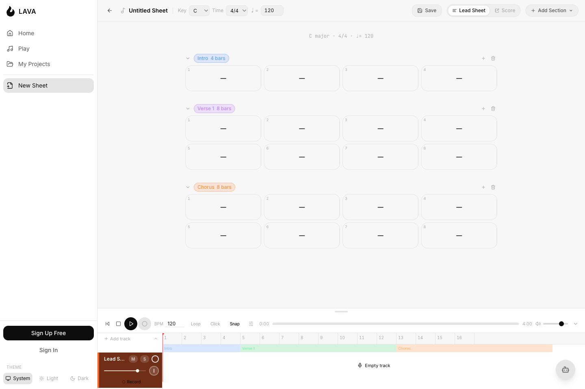
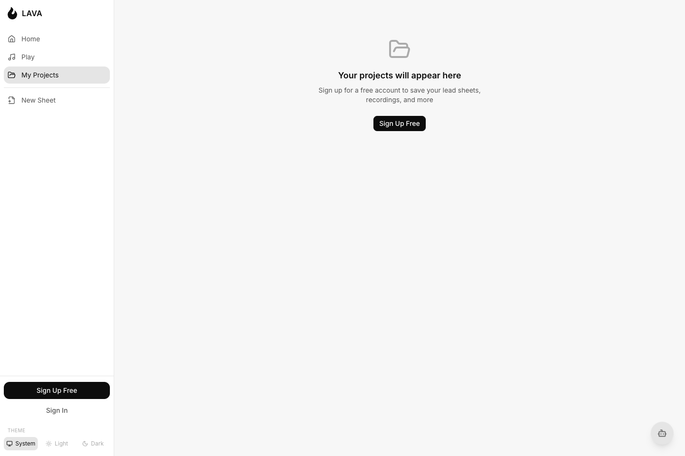

# PRD：LAVA AI

> 本文档基于 `/Users/p3tr4/Documents/LavaAI-demo` 当前原型与代码库逆向整理而成。文中截图来自本地开发环境，于 2026 年 3 月 24 日采集。

## 背景与目标

### 问题

音乐爱好者和学习者在找歌、提取和弦、跟伴奏练习、记录灵感、保存作品时，往往需要在多个工具之间来回切换。这种割裂的流程会降低从灵感到练习、再到创作的连续性。

### 目标

LAVA AI 旨在验证一个“AI 驱动的一体化音乐练习与创作平台”原型。当前产品核心围绕以下主链路展开：

1. 发现一首歌或一个音乐想法；
2. 生成或打开可演奏的谱面；
3. 配合伴奏或录音进行练习；
4. 将过程保存为可复用项目。

同时，产品也在探索两个次级方向：

- 面向自由演奏的 Jam / Play 体验；
- 面向轻量创作的 Lead Sheet 编辑体验。

### 成功信号

如果用户能够完成以下闭环，可视为原型验证有效：

- 从首页发起歌曲搜索；
- 在搜索结果中启动 AI 生成；
- 看到生成进度，并在结果准备好后继续进入练习；
- 进入可练习的谱面与音频工作区；
- 在练习中录音或编辑素材；
- 将结果保存到 Projects，便于后续继续使用。

### 当前主要页面

当前原型主要由以下页面构成：

- 首页与搜索入口
- 搜索结果页
- 歌曲练习页
- Play Hub
- Jam 会话页
- Lead Sheet 编辑器
- 项目中心
- 设置、定价、登录与注册页

代码中还能看到一些历史页面或未完成页面，但它们目前不是产品主线的一部分。

## 用户角色

- **歌曲学习者**：希望快速找到一首歌、拿到可演奏谱面，并配合伴奏练习的吉他、钢琴、声乐等用户。
- **练习型创作者**：会在练习过程中录音、叠轨、尝试伴奏，并希望轻量保存工作进度的音乐人。
- **Lead Sheet 创作者**：希望自己编写和弦图、整理结构、导入 PDF 乐谱，并与参考音频配套使用的用户。
- **付费进阶用户（推断）**：关注更高 AI 配额、更大存储、更丰富轨道能力与更高级导出格式的高频用户。

## 用户故事

### 发现与搜索

- 作为歌曲学习者，我希望从一个简单搜索框开始，这样我不需要理解复杂导航也能进入练习流程。
- 作为歌曲学习者，我希望看到带有缩略图和歌曲信息的搜索结果，这样我能更快选中正确歌曲。
- 作为游客用户，我希望在注册前就理解产品价值，这样我能决定是否值得创建账号。

### AI 谱面生成

- 作为歌曲学习者，我希望从搜索结果一键生成谱面和伴奏，这样即使我手上没有现成乐谱，也能马上开始练习。
- 作为回访用户，我希望 AI 生成过程在我切换页面后也不要中断，这样我不必停留在同一个页面等待。
- 作为用户，我希望失败的生成任务可以被看见并重新开始，这样临时错误不会直接打断我的流程。

### 歌曲练习工作区

- 作为歌曲学习者，我希望看到调性、速度以及不同形式的乐谱展示，这样我能按自己偏好的方式阅读并练习。
- 作为练习型创作者，我希望在歌曲时间线上录音并叠加已提交的音频片段，这样我可以记录练习过程。
- 作为回访用户，我希望把一次练习会话保存到 Projects，这样我下次可以继续。

### Play / Jam

- 作为练习型创作者，我希望有一个专门的 Play Hub 来浏览风格、音色和伴奏内容，这样我能从“学歌”自然过渡到“自由 Jam”。
- 作为 Jam 用户，我希望能快速设置 Key、BPM、节拍器、风格和伴奏库，这样我可以迅速开始演奏。
- 作为已登录用户，我希望通过自然语言请求 AI 生成伴奏，这样我能按需创建练习素材。

### Lead Sheet 编辑与项目管理

- 作为 Lead Sheet 创作者，我希望创建段落、编辑乐谱元数据，并可选导入 PDF 乐谱，这样我能构建自己的可复用谱面。
- 作为回访用户，我希望保存的内容可以按项目集中管理，并支持筛选和重开，这样我能持续管理自己的音乐资产。

### 账号与商业化

- 作为游客用户，我希望在触发受限功能时看到明确注册提示，这样我知道哪些价值需要登录后才能获得。
- 作为潜在付费用户，我希望看到不同套餐的差异与使用量信息，这样我能判断是否值得升级。

## 功能需求

### 发现与搜索

- 当用户进入首页时，系统应以“你想弹什么”为核心，提供搜索优先的入口。
- 当用户在首页提交搜索内容时，系统应跳转到搜索结果页并带上查询参数。
- 当用户未登录时，系统应在首页与游客欢迎弹层中展示注册引导。
- 当用户已登录且仍处于免费计划时，系统应展示与月度 AI 次数限制相关的升级提示。
- 当用户进入搜索结果页并带有查询词时，系统应展示与该歌曲相关的搜索结果。
- 当搜索进行中时，系统应展示 Skeleton 加载状态。
- 当搜索失败时，系统应展示错误状态与重试入口。
- 当搜索无结果时，系统应展示针对当前查询词的空状态文案。

### AI 谱面生成与进度反馈

- 当用户在搜索结果弹层中做出选择时，系统应将“AI Score + Backing Track”作为主路径提供。
- 当已登录用户启动 AI 生成时，系统应开始生成流程，并把用户带入歌曲练习页。
- 当生成尚未完成时，系统应持续向用户展示当前进度。
- 当用户暂时离开当前页面时，生成过程不应因此中断。
- 当生成完成时，系统应展示提醒，并提供进入结果页的直接入口。
- 当生成失败时，系统应展示错误状态，并允许用户重新开始。
- 当同一首歌已经存在可直接使用的结果时，系统应优先复用已有结果，减少重复等待。

### 歌曲练习工作区

- 当用户打开静态歌曲页或 AI 生成歌曲页时，系统应展示歌曲标题、调性、速度、拍号等基础信息。
- 当用户已经导入乐谱文件时，系统应允许用户在简谱视图与乐谱视图之间切换。
- 当 AI 分析仍在进行时，歌曲页应显示阶段性进度，并允许用户稍后再回来看结果。
- 当 AI 分析完成时，系统应自动生成歌曲结构、速度与调性等练习信息。
- 当生成结果中包含参考音频时，系统应将其带入当前练习区，方便用户直接配合播放。
- 当用户在歌曲工作区中录音或导入已提交音频片段时，系统应将当前会话视为可保存内容。
- 当用户在存在未保存录音内容的情况下离开页面时，系统应阻止导航并提示保存。
- 当用户保存一次歌曲练习会话时，系统应将其保存到项目中心，供之后再次打开。

### Play / Jam

- 当用户打开 Play Hub 时，系统应展示 AI 输入栏、推荐音色、设备内容与 Play 相关子入口。
- 当用户进入 Jam 会话页时，系统应提供 Key、BPM、节拍器、风格、播放控制、主音量与伴奏库选择能力。
- 当用户在 Jam 页中打开伴奏库时，系统应允许按照 Drum Grooves、Melodic Loops、Backing Tracks 与 AI Generation 分类查看内容。
- 当用户在 Jam 页请求 AI 生成伴奏时，系统应先校验登录状态。
- 当一次 Jam 会话启动时，系统应为用户准备基础伴奏轨道，帮助其快速进入演奏状态。

### Lead Sheet 编辑与项目持久化

- 当用户新建打开编辑器时，系统应初始化一个新的可编辑谱面工作区。
- 当用户打开一个已保存项目时，系统应恢复此前保存的谱面内容与结构。
- 当已保存项目中包含录音内容时，系统应尽可能恢复这些内容，帮助用户继续上次工作。
- 当用户编辑调性、速度、拍号、项目名称或段落结构时，系统应将当前状态标记为可保存内容。
- 当用户新增段落时，系统应允许选择常见结构类型，例如前奏、主歌、副歌、桥段、尾奏或自定义段落。
- 当用户切换到 Score 模式但尚未导入乐谱时，系统应展示明确的导入引导。
- 当用户上传乐谱文件时，系统应完成保存并在 Score 模式中显示。
- 当用户在存在未保存修改时离开编辑器，系统应展示未保存变更提示框。

### Projects、账号与商业化

- 当未登录用户打开 Projects 时，系统应展示注册引导，而不是项目列表。
- 当已登录用户打开 Projects 时，系统应展示其已保存内容，并支持按类型筛选与继续打开。
- 当用户删除项目时，系统应先进行不可逆操作确认，再发起删除请求。
- 当用户在未登录状态访问 Settings 时，系统应跳转到 Login 页。
- 当已登录用户进入 Subscription 设置页时，系统应展示当前套餐下的 AI 使用量与存储使用量。
- 当用户访问 Pricing 页时，系统应展示 Free、Pro、Studio 三档套餐的功能差异与升级入口。
- 当游客尝试使用 AI 生成、保存项目等受限功能时，系统应打开注册/登录提示弹层，而不是继续执行。

## 交互流程

### 主流程：搜索歌曲并进入 AI 练习页

1. 用户进入首页，输入歌曲名、艺人名或链接。
2. 系统跳转到搜索结果页并展示相关歌曲结果。
3. 用户选择某个结果，并点击 `AI Score + Backing Track`。
4. 如果用户未登录，系统先要求注册或登录。
5. 系统启动分析流程；如果这首歌已有结果，则直接复用。
6. 系统进入歌曲练习页，并开始展示生成进度。
7. 用户可以留在当前页等待，也可以先去别处继续浏览。
8. 当分析完成时，系统会把歌曲结构、练习信息与参考音频带入练习工作区。
9. 用户进行练习、录音，并可选择保存为项目。

**边界情况**

- 搜索无结果。
- 搜索结果获取失败。
- 生成完成，但结果内容不完整，无法直接进入练习。
- 生成失败，需要用户重新发起。
- 用户在任务完成前离开页面，之后通过通知再次进入结果页。

### 次级流程：自由 Jam

1. 用户从导航进入 Play。
2. 系统展示音色推荐、AI 输入栏与 Play 内容集合。
3. 用户进入 Jam 会话页。
4. 用户调整 Key、BPM、节拍器与风格。
5. 用户选择伴奏库素材，或请求 AI 生成新伴奏。
6. 用户通过播放控制和底部轨道区开始演奏与练习。

**边界情况**

- 用户未登录时尝试使用 AI 生成功能。
- 当前分类下没有可选伴奏内容。
- 播放在到达时长末尾后自动停止。

### 次级流程：创建并保存 Lead Sheet

1. 用户打开新的 Lead Sheet 编辑器，或打开已存在项目。
2. 用户编辑谱面名称、音乐元数据与段落结构。
3. 用户可选上传乐谱文件用于 Score 模式显示。
4. 用户在底部轨道区录音或附加音频。
5. 用户保存谱面到 Projects。
6. 保存成功后，系统将其视为一个可持续编辑的正式项目。

**边界情况**

- 打开一个不存在或不可用的项目时，系统回到项目中心。
- 乐谱上传失败。
- 用户离开前存在未保存变更，系统要求先做保存决策。

### 支撑流程：重开已保存项目

1. 用户打开 Projects。
2. 系统加载并筛选历史项目。
3. 用户选择某个项目。
4. 系统进入对应工作区，并恢复此前保存的主要内容。

**边界情况**

- 用户未登录，只能看到注册引导页。
- 用户在 Projects 中删除项目。
- 某些录音内容无法完整恢复，但项目其余内容仍可继续使用。

## 验收标准

### 发现与搜索

- [ ] 用户可以从首页提交查询并顺利进入搜索结果页。
- [ ] 搜索结果具备 loading、success、empty 与 error 四类状态。
- [ ] 点击搜索结果后，系统会打开包含至少两种下一步操作的弹层。

### AI 谱面生成

- [ ] 启动生成后，用户会进入歌曲页，并清楚看到生成进度。
- [ ] 即使用户暂时离开当前页面，生成过程也不会被打断。
- [ ] 生成完成后，用户可以直接再次打开结果页。

### 歌曲练习工作区

- [ ] 完成后的歌曲页会展示标题、调性、速度与拍号。
- [ ] AI 生成结果会正确填充谱面结构，并在可用时附带参考音频。
- [ ] 当存在未保存录音内容时，离开页面会触发保存确认。

### Play / Jam

- [ ] Jam 页允许用户修改 Key、BPM、风格、音量与节拍器状态。
- [ ] Jam 页提供可浏览的伴奏库，支持分类筛选。
- [ ] 游客在 Jam 页请求 AI 生成时会被登录弹层拦截。

### Lead Sheet 编辑

- [ ] 用户可以在新建谱面中新增具名段落。
- [ ] 用户可以在 Lead Sheet 与 Score 两种模式之间切换；当没有 PDF 时，系统提供导入入口。
- [ ] 新建谱面保存后，系统会生成一个可反复继续编辑的项目。

### Projects 与商业化

- [ ] 已登录用户可以查看、筛选、打开和删除项目。
- [ ] 未登录用户在 Projects 中只能看到注册引导态。
- [ ] Pricing 与 Subscription 页面能够表达套餐差异和当前免费计划使用量。

## 不在本阶段范围内

- 超出当前底部轨道编辑区范围的完整桌面级编曲工作流。
- 真正接入外部身份服务的生产级账号系统。
- 真实支付、订阅购买或账单能力。
- 服务端强校验的 AI 配额、存储限额与套餐权限控制。
- 除 PDF 相关能力外的高级导出流程，例如完整 MusicXML 工作流。
- 代码中存在但当前未作为主线开放的独立空间页面，如旧版 `learn`、`create`、`tools`、`library` 等。

## 非功能需求

- **性能**：搜索、切页与打开项目应足够流畅，不应让用户感到明显等待。
- **可靠性**：长耗时生成流程应稳定，用户即使切换页面，回来后也仍能看到清晰结果或进度。
- **安全与隐私**：当前原型仍偏演示性质，正式产品需要补齐账号安全、项目归属和上传内容保护能力。
- **可访问性**：关键弹层、主要按钮和核心流程应保证清晰、易理解，并尽量兼顾键盘操作与阅读辅助能力。
- **可观测性**：产品应能让团队看见生成是否成功、失败发生在哪一步，以及用户是否顺利完成主要流程。
- **平台支持**：当前产品定位为响应式 Web，应同时兼顾桌面端与移动端使用体验。

## 开放问题

- “Backing Track Only” 这条分支的目标体验是什么？从当前原型看，这条路径还缺少一个清晰、完整的承接页面。
- Jam 页中的 “Browse Tracks” 未来是要进入独立页面，还是继续停留在当前页内完成选择？
- 代码中仍存在的 `create`、`tools`、`library`、旧版 `learn hub` 等页面，哪些还在产品路线图中，哪些已确定废弃？
- 项目数据目前看起来更像 Demo 级全局存储，后续是否要改为“与登录用户绑定”的真实项目系统？
- AI 次数、存储配额与套餐限制当前更像展示性文案，后续是否需要进入服务端真实约束？
- Onboarding 中采集的 skill level 后续是否要参与推荐、难度标记或练习引导？目前看起来只用于首启流程。
- Projects 页右上角的 `New Project` 未来预期要进入哪个创建流程？
- 账号编辑、第三方登录、升级购买与删除账号这些能力是继续保持原型态，还是下一阶段要优先接入真实服务？
